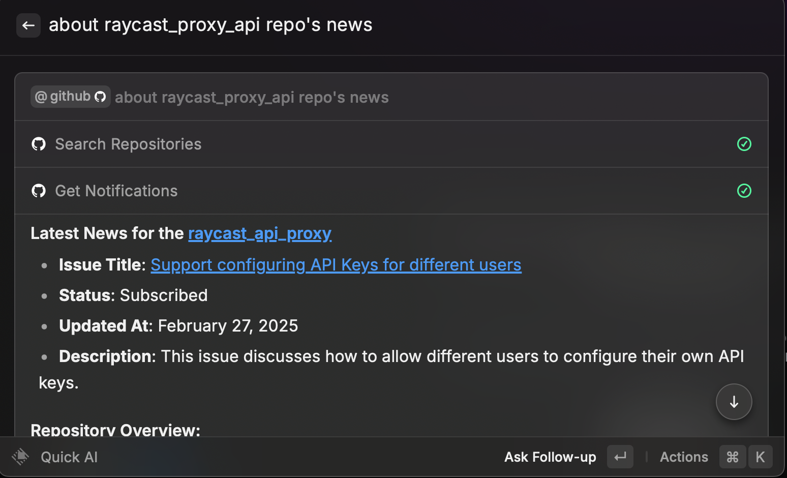

# Raycast AI プロキシ

これは、シンプルな [Raycast AI](https://raycast.com/) API プロキシです。サブスクリプションなしで [Raycast
AI](https://raycast.com/ai)を使用できる代替手段です。このプロキシは、RaycastのリクエストをOpenAIのAPIに変換し、応答をリアルタイムで変換してRaycastに転送します。

[English](README.md) | [中文](README.zh.md) | [日本語](README.ja.md)

## 紹介

本プロジェクトはミドルマンプロキシの方式を採用し、RaycastのリクエストをOpenAIのAPIに転送し、OpenAIの応答をRaycastに転送します。

本プロジェクトは以下のインターフェイスを主にマッピングしています：

- `GET /api/v1/me`: ユーザーのAI機能のフラグを変更
- `POST /api/v1/translations`: 翻訳インターフェイス
- `POST /api/v1/ai/chat_completions`: AI機能の共通インターフェイス
- `GET /api/v1/ai/models`: AIモデルのリストインターフェイス

ミドルマンプロキシの簡単な原理は、DNSを変更してRaycastのリクエストのIPを本プロジェクトのアドレスに向け、その後リクエストをOpenAIのAPIに転送し、そこで得た応答をRaycastに転送することです。
しかし、RaycastとRaycast
APIの間ではHTTPSが使用されているため、自署証明書が必要であり、Raycastがその証明書を信頼する必要があります。詳細なミドルマンプロキシの原理については(<https://docs.mitmproxy.org/stable/conc>
epts-howmitmproxyworks/)をご参照ください。

### AI拡張機能



### サポートされているモデル
>
> 複数のモデルを同時に使用することが可能で、ただし環境変数を設定する必要があります

| モデルプロバイダー | モデル | テスト状況 | 画像生成 | Web検索 | AI拡張機能 |
| --- | --- | --- | --- | --- | --- |
| `openai` | **from api** | テスト済み | サポート | 未サポート | サポート |
| `azure openai` | 同上 | テスト済み | サポート | 未サポート | 未サポート |
| `google` | **from api** | テスト済み | 未サポート | **from api** | 未サポート |
| `anthropic` | claude-3-sonnet, claude-3-opus, claude-3-5-opus | テスト済み | 未サポート | 未サポート | 未サポート |

#### サポートされている OpenAI API 互換プロバイダー

##### [Ollama](https://ollama.com/) の例

環境変数を追加

- `OPENAI_PROVIDER=ollama`
- `OPENAI_BASE_URL=http://localhost:11434/v1`
- `OPENAI_API_KEY=ollama` # 必須ですが、使用されません

モデルは `http://localhost:11434/v1/models` から取得されます。

### Ai チャット

!(./assert/img/chat.jpeg)

### 翻訳

!(./assert/img/translate.jpg)

## 使用方法

### インストールと設定

#### 1. 証明書を生成

```sh
pip3 install mitmproxy
python -c "$(curl -fsSL https://raw.githubusercontent.com/yufeikang/raycast_api_proxy/main/scripts/cert_gen.py)"  --domain backend.raycast.com  --out ./cert
```

あるいは

このリポジトリをクローンし、以下のコマンドを実行

```sh
pip install uv
uv venv
source .venv/bin/activate
uv pip install -e ".[dev]"
python scripts/cert_gen.py --domain backend.raycast.com --out ./cert
```

#### 2. 証明書をシステムキーチェーンに信頼として追加

`cert` フォルダ内のCA証明書を開き、システムキーチェーンに追加して信頼する必要があります。
これは**必須**です。Raycast AI プロキシは自署証明書を使用しているため、それを信頼しなければ正常に動作しません。

注意：

Apple
Silicon搭載のmacOSを使用している場合、手動で`鍵のアクセス`にCA証明書を追加する際にアプリケーションがハングする問題が発生した場合には、以下のコマンドをターミナルで使用して代替することがで
きます：

(<https://docs.mitmproxy.org/stable/concepts-certificates/#installing-the-mitmproxy-ca-certificate-manually>)

```shell
sudo security add-trusted-cert -d -p ssl -p basic -k /Library/Keychains/System.keychain ~/.mitmproxy/mitmproxy-ca-cert.pem
```

#### 3. `/etc/hosts` ファイルを編集し、以下の行を追加

```
127.0.0.1 backend.raycast.com
::1 backend.raycast.com
```

この変更の目的は、`backend.raycast.com`をローカルアドレス（127.0.0.1）に向けることで、実際の`backend.raycast.com`ではなくプロキシにリクエストを送信することです。

当然ながら、独自のDNSサーバーにこのレコードを追加することも可能です。最終的な目的は、`backend.raycast.com`をプロキシのデプロイアドレスに向けることです。ここでの127.0.0.1は、デプロイアド
レスに置き換えることができます。このプロジェクトをクラウドやローカルネットワークにデプロイした場合、そのデプロイアドレスに向けるように設定できます。

#### 4. サービスを起動

```sh
docker run --name raycast \
    -e OPENAI_API_KEY=$OPENAI_API_KEY \
    -p 443:443 \
    --dns 1.1.1.1 \
    -v $PWD/cert/:/data/cert \
    -e CERT_FILE=/data/cert/backend.raycast.com.cert.pem \
    -e CERT_KEY=/data/cert/backend.raycast.com.key.pem \
    -e LOG_LEVEL=INFO \
    -d \
    ghcr.io/yufeikang/raycast_api_proxy:main
```

このサービスをクラウドまたはローカルネットワークにデプロイし、Raycastがそのアドレスにアクセスできるようにすることも可能です。

**その後、Raycastを再起動して使用を開始できます。**

### 高度な設定

#### 1. Azure OpenAI APIを使用する

[How to switch between OpenAI and Azure OpenAI endpoints with Python](https://learn.microsoft.com/en-us/azure/ai-services/openai/how-to/switching-endpoints)を参考にしてください。

適切な環境変数を設定するだけでOKです。

```sh
docker run --name raycast \
    -e OPENAI_API_KEY=$OPENAI_API_KEY \
    -e OPENAI_BASE_URL=https://your-resource.openai.azure.com \
    -e OPENAI_API_VERSION=2023-05-15 \
    -e OPENAI_API_TYPE=azure \
    -e AZURE_DEPLOYMENT_ID=your-deployment-id \
    -p 443:443 \
    --dns 1.1.1.1 \
    -v $PWD/cert/:/data/cert \
    -e CERT_FILE=/data/cert/backend.raycast.com.cert.pem \
    -e CERT_KEY=/data/cert/backend.raycast.com.key.pem \
    -e LOG_LEVEL=INFO \
    -d \
    ghcr.io/yufeikang/raycast_api_proxy:main
```

#### 2. Google Gemini APIの使用

> OpenAI APIと併せて同時に使用することが可能です。必要に応じて環境変数を設定するだけです。

[Google API Key](https://makersuite.google.com/app/apikey)を取得し、それを`GOOGLE_API_KEY`として環境変数にエクスポートします。

```sh
# このリポジトリをクローンしてディレクトリに移動
docker build -t raycast .
docker run --name raycast \
    -e GOOGLE_API_KEY=$GOOGLE_API_KEY \
    -p 443:443 \
    --dns 1.1.1.1 \
    -v $PWD/cert/:/data/cert \
    -e CERT_FILE=/data/cert/backend.raycast.com.cert.pem \
    -e CERT_KEY=/data/cert/backend.raycast.com.key.pem \
    -e LOG_LEVEL=INFO \
    -d \
    raycast:latest
```

#### 3. ローカルで手動起動

1. このリポジトリをクローンします
2. 依存関係をインストール：

```sh
pip install uv
uv venv
source .venv/bin/activate
uv pip install -e ".[dev]"
```

3. 環境変数を作成：

```sh
export OPENAI_API_KEY=<your openai api key>
```

4. 自署証明書を生成：

```sh
python scripts/cert_gen.py --domain backend.raycast.com --out ./cert
```

5. サービスを起動：

```sh
python ./app/main.py
```

#### 4. ローカル開発

ローカル開発中にDNSがループしてしまうのを避けるために、Dockerを使用し、指定したDNSで開発環境を起動することが推奨されます。

参考：

```sh
sh ./local_docker.sh
```

#### 5. カスタムマッピングの使用

プロジェクトディレクトリ内の`custom_mapping.yml.example`ファイルを参考にして、いくつかのインターフェイスの応答をカスタムマッピングで変更することができます。

```yaml
"api/v1/me/trial_status":
  get:
    response:
      body:
        # jsonパスの置換
        "$.trial_limits.commands_limit": 30
```

例えば上記の設定では、`GET api/v1/me/trial_status` インターフェイスの応答の中で `$.trial_limits.commands_limit` を `30` に置き換えます。それぞれの`$.trial_limits.commands_limit` は
(<https://goessner.net/articles/JsonPath/>) です。

現在のところ、レスポンスボディの置換のみサポートされています。

#### 6. 複数ユーザーの共有サービス

複数のユーザーがこのサービスを共有する場合や、サービスをパブリックにデプロイする場合、サービスを使用できるユーザーを制限することができます。 `ALLOWED_USERS`
環境変数を設定して、このサービスを使用できるユーザーを制限します。

```env
ALLOWED_USERS="xx@example.com,yy@example.com"
```

メールアドレスはRaycastユーザーのメールアドレスであり、複数のユーザーはカンマで区切ります。

### 注意事項

1. DNS指定
GFWの存在により、中国国内で使用する場合、国内のDNSサーバーを指定する必要がある場合があります。例： `--dns 223.5.5.5`

2. DNSの無効化
macOSで`/etc/hosts`ファイルを変更してもDNSが有効にならない場合があり、現時点での解決方法は見つかっていません。Raycastを再起動するか、`/etc/hosts`ファイルを再編集する方法が有効になること
があります。
